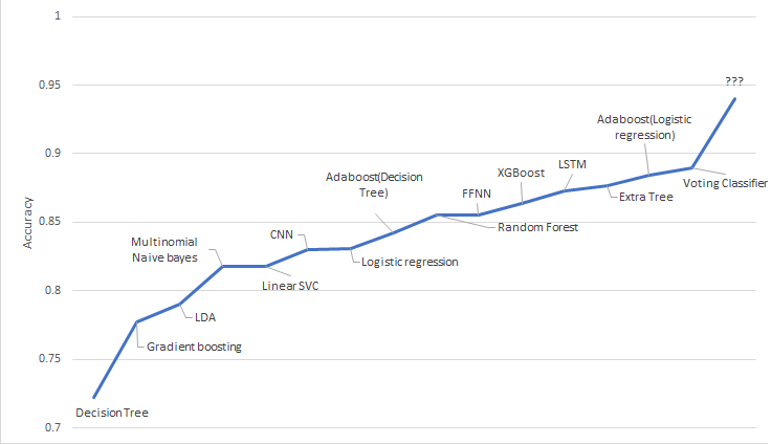

# Sentiment Analysis

## Introduction

The goal of this project is to construct several sentiment analysis models that can
accurately classify the binary-classes. In the digital age, with internet platforms such as
Instagram, Facebook, and IMDB, consumers are passionate about sharing their
pictures and opinions on these websites/APPs. These texts being uploaded carry great
values for doing opinion mining. With the help of opinion mining systems, this
unstructured information could be automatically transformed into structured data of
public opinions about products, services, brands, politics, or any topic that people can
express opinions about. This data can be very useful for commercial applications like
marketing analysis, public relations, product reviews, net-promoter scoring, product
feedback, and customer service. The aim of this project is to capitalize on this trend and
analyze the sentiment behind the reviews provided by customers on IMDB. We read
some blogs on text cleaning and referred documentation for packages such as keras,
nltk, tensorflow, etc.

## Dataset

**Link**: https://ai.stanford.edu/~amaas/data/sentiment/. (Movie reviews from the Large
Movie Review Dataset, sometimes known as the IMDB dataset. In this task, given a
movie review, the model attempts to predict whether it is positive or negative. This is a
binary classification task.)

**Description**: This dataset contains movie reviews along with their associated binary
sentiment polarity labels. It is intended to serve as a benchmark for sentiment
classification. In the labeled train/test sets, a negative review has a score <= 4 out of 10,
and a positive review has a score >= 7 out of 10. Thus, reviews with more neutral ratings
are not included in the train/test sets. Reviews are stored in text files named following the
convention [[id]_[rating].txt] where [id] is a unique id and [rating] is the star rating for that
review on a 1-10 scale. For example, the file [test/pos/200_8.txt] is the text for a positivelabeled test set example with a unique id 200 and star rating 8/10 from IMDb.

**Number of records**: The core dataset contains 50,000 reviews split evenly into 25k train
and 25k test sets. The overall distribution of labels is balanced (25k pos and 25k neg).

## Data Preprocessing

We use the following steps for preprocessing the text data:

1. Removed html tags 
2. Converted all text to lower case 
3. Tokenized the text
4. Removed stop words 
5. Removed punctuatuion and non-alphabetic characters
6. Added part of speech to each token 
7. Lemmatized tokens 
8. Constructed new cleaned reviews

## Models Implemented

1. **Logistic Regression**

2. **Multinomial Naive Bayes**

3. **LDA (Linear Discriminant Analysis)**

4. **Decision Tree**

5. **Linear SVC (Support Vector Classification)**

6. **RBF SVM (Radial Basis Function kernal SVM)**

7. **Random Forest**

8. **Adaboost (with decision tree)**

9. **Adaboost (with logistic regression)**

10. **Extra Tree Classifier**

11. **Gradient Boosting Classifier**

12. **XGBoost Classifier**

13. **Voting Classifier**

14. **Feed Forward Neural Netwrok (FFNN)**

15. **Convolutional Neural Network (CNN)** 

16. **Stacked bidirectional LSTM**

## Results

1. **Logistic Regression**

Dataset | Accuracy | Precision | Recall | F1-Score
--- | --- | --- | --- |---  
Train | 1.0 | 1.0 | 1.0 | 1.0  
Test| 0.832 | 0.843 | 0.815 | 0.828 

Logistic regression overfits the training data. In fact being a simple algorithm, it still gives an accuracy
of 83% which is good compared to classifiers like multinomial naive bayes, linear support vector
classifier, etc. Accuracy can be improved by reducing overfitting using ridge regression.

2. **Multinomial Naive Bayes**

Dataset| Accuracy | Precision | Recall | F1-Score
--- | --- | --- | --- |---  
Train | 0.872 | 0.886 | 0.854 | 0.870  
Test| 0.817 | 0.855 | 0.765 | 0.808 

Multinomial naive bayes gives lower accuracy compare to logistic regression but gives higher
precision. So it is good at classifying positive reviews.

3. **LDA (Linear Discriminant Analysis)**

Dataset | Accuracy | Precision | Recall | F1-Score
--- | --- | --- | --- |---  
Train | 0.962 | 0.953 | 0.964 | 0.961  
Test| 0.790 | 0.798 | 0.777 | 0.787 

Linear discriminant analysis again overfits the training data and doesn’t generalize well to test data,
giving a poor accuracy.

4. **Decision Tree**

Dataset | Accuracy | Precision | Recall | F1-Score
--- | --- | --- | --- |---  
Train | 1.0 | 1.0 | 1.0 | 1.0  
Test| 0.718 | 0.720 | 0.715 | 0.717 

Decision tree overfits the training data perfectly with zero error. It is not great at generalizing to
unseen data and hence gives the lowest accuracy compared to all the models we tried.

5. **Linear SVC (Support Vector Classification)**

Dataset | Accuracy | Precision | Recall | F1-Score
--- | --- | --- | --- |---  
Train | 1.0 | 1.0 | 1.0 | 1.0  
Test| 0.818 | 0.831 | 0.799 | 0.814

Linear Support vector classifier also overfits the training data but is better than decision tree at generalizing to test dataset.

6. **Random Forest**

Dataset | Estimators | Accuracy | Precision | Recall | F1-Score
--- | --- | --- | --- |--- | ---  
Train | 10 | 0.993 | 0.998 | 0.989 | 0.993 
Test | 10 | 0.774 | 0.818| 0.705 | 0.757 
Train | 50 | 1.0 | 1.0 | 1.0 | 1.0 
Test | 50 | 0.835 | 0.845| 0.822 | 0.833 
Train | 200 | 1.0 | 1.0 | 1.0 | 1.0 
Test | 200 | 0.852 | 0.858 | 0.844 | 0.851 

7. **Adaboost (with decision tree)**

Dataset | Accuracy | Precision | Recall | F1-Score
--- | --- | --- | --- |---  
Test| 0.850 | 0.840 | 0.865 | 0.852

Adaboost with decision tree combines several weak decision tree classifiers and generalizes well on
testing data compared to single decision tree.

8. **Adaboost (with logistic regression)**
 
Dataset | Accuracy | Precision | Recall | F1-Score
--- | --- | --- | --- |---  
Train | 0.927 | 0.920 | 0.935 | 0.927 
Test| 0.885 | 0.885 | 0.884 | 0.885

Adaboost with logistic regression works well with our data. It does not overfit training data and so
generalizes well on testing data when compared to logistic regression.

9. **Gradient Boosting Classifier**

Dataset | Accuracy | Precision | Recall | F1-Score
--- | --- | --- | --- |---  
Test| 0.780 | 0.743 | 0.857 | 0.796

Gradient boosting gives us a low accuracy but high recall.

10. **XGBoost Classifier**

Dataset | Accuracy | Precision | Recall | F1-Score
--- | --- | --- | --- |---  
Test| 0.877 | 0.867 | 0.889 | 0.878

XGboost overall performs better than most of the models, giving high accuracy and f1-score.

11. **Voting Classifier**

Test accuracy: 0.89 

We use soft voting with Multinomial Naive Bayes, Logistic Regression, Extra Tree and XGboost. 

12. **Feed Forward Neural Netwrok (FFNN)**
 
Dataset | Accuracy | Precision | Recall | F1-Score
--- | --- | --- | --- |---  
Train | 0.998 | 0.999 | 0.997 | 0.9998 
Test| 0.848 | 0.891 | 0.793 | 0.839

Feed forward neural network overfits the training data, but still does well at generalizing to test data.
It gives high precision but low recall.

### ROC Curve

  
     
    <em>ROC Curve</em>

AUC (area under curve) provides an aggregate measure of performance across all possible classification thresholds. AUC ranges in value from 0 to 1. A model whose predictions are 100% wrong has an AUC of 0.0; one whose predictions are 100% correct has an AUC of 1.0.

We see that adaboost with logistic regression has the highest AUC and value.

### Accuracy Heirarchy

  
     
    <em>Accuracy Heirarchy</em>

The above lineplot summarizes the accuracies for different models we implemented. 
