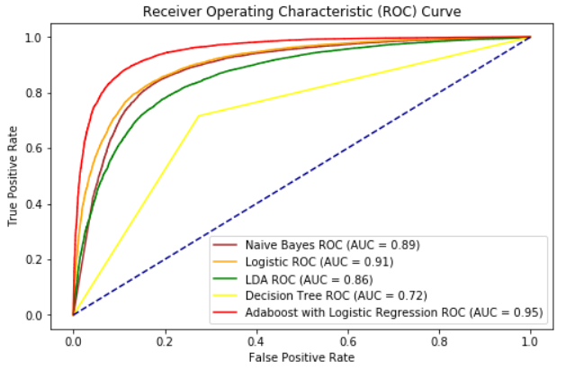
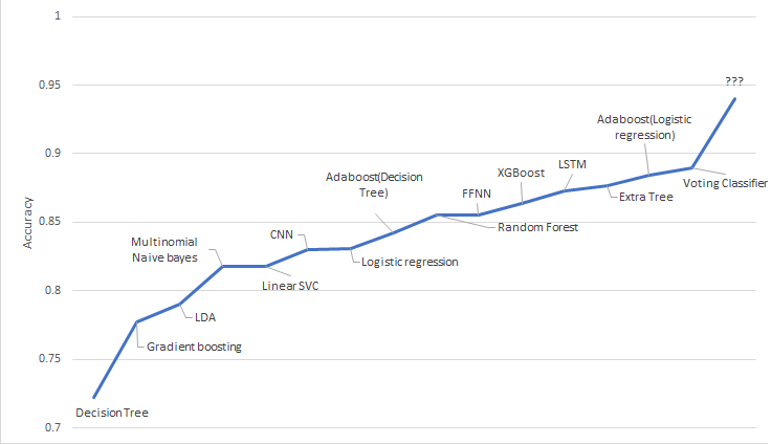

# Sentiment Analysis

## Introduction

The goal of this project is to construct several sentiment analysis models that can
accurately classify the binary-classes. In the digital age, with internet platforms such as
Instagram, Facebook, and IMDB, consumers are passionate about sharing their
pictures and opinions on these websites/APPs. These texts being uploaded carry great
values for doing opinion mining. With the help of opinion mining systems, this
unstructured information could be automatically transformed into structured data of
public opinions about products, services, brands, politics, or any topic that people can
express opinions about. This data can be very useful for commercial applications like
marketing analysis, public relations, product reviews, net-promoter scoring, product
feedback, and customer service. The aim of this project is to capitalize on this trend and
analyze the sentiment behind the reviews provided by customers on IMDB. We read
some blogs on text cleaning and referred documentation for packages such as keras,
nltk, tensorflow, etc.

## Dataset

**Link**: https://ai.stanford.edu/~amaas/data/sentiment/. (Movie reviews from the Large
Movie Review Dataset, sometimes known as the IMDB dataset. In this task, given a
movie review, the model attempts to predict whether it is positive or negative. This is a
binary classification task.)

**Description**: This dataset contains movie reviews along with their associated binary
sentiment polarity labels. It is intended to serve as a benchmark for sentiment
classification. In the labeled train/test sets, a negative review has a score <= 4 out of 10,
and a positive review has a score >= 7 out of 10. Thus, reviews with more neutral ratings
are not included in the train/test sets. Reviews are stored in text files named following the
convention [[id]_[rating].txt] where [id] is a unique id and [rating] is the star rating for that
review on a 1-10 scale. For example, the file [test/pos/200_8.txt] is the text for a positivelabeled test set example with a unique id 200 and star rating 8/10 from IMDb.

**Number of records**: The core dataset contains 50,000 reviews split evenly into 25k train
and 25k test sets. The overall distribution of labels is balanced (25k pos and 25k neg).

## Data Preprocessing

We use the following steps for preprocessing the text data:

1. Removed html tags 
2. Converted all text to lower case 
3. Tokenized the text
4. Removed stop words 
5. Removed punctuatuion and non-alphabetic characters
6. Added part of speech to each token 
7. Lemmatized tokens 
8. Constructed new cleaned reviews

## Results

#### ROC Curve

  
     
    <em>ROC Curve</em>

#### AUC Heirarchy

  
     
    <em>AUC Heirarchy</em>

